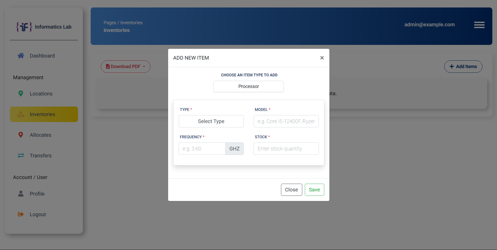

<p align="center">
  <a href="https://laravel.com" target="_blank">
    
  </a>
</p>

<p align="center">
  <a href="https://github.com/ka18aihaqi/inventory-qr-code/actions">
    
  </a>
  <a href="https://packagist.org/packages/ka18aihaqi/inventory-qr-code">
    
  </a>
  <a href="https://packagist.org/packages/ka18aihaqi/inventory-qr-code">
    
  </a>
  <a href="https://packagist.org/packages/ka18aihaqi/inventory-qr-code">
    
  </a>
</p>

## About Inventory Website with QR Code Integration

This project is a **web-based inventory management system** developed as my final project at Telkom University. It uses **Laravel, MySQL, JavaScript, and QR Code integration** to streamline asset management and tracking.

**Key Features:**
- **Login system** for secure user access.
- **Input asset data**, including detailed information and categorization.
- **Asset allocation** and assignment to specific locations.
- **Transfer assets** between different locations to maintain real-time inventory status.
- **QR Code identification** to easily track and identify specific tables or locations within the system.

**Live Demo:** [https://informaticslabstelu.com](https://informaticslabstelu.com)

## Technologies Used

- Laravel
- MySQL
- JavaScript
- QR Code Integration

## 📸 Screenshots

### 🧾 Dashboard


### 📝 Form Input


### 📄 Asset Allocation


### 📄 Computer Spescfications


### 📄 Form Transfer


## Getting Started

To set up the project locally, follow these steps:

```bash
# Clone the repository
git clone https://github.com/ka18aihaqi/inventory-qr-code.git

# Install dependencies
composer install
npm install && npm run dev

# Setup environment variables
cp .env.example .env
php artisan key:generate

# Run migrations
php artisan migrate

# Start the development server
php artisan serve
